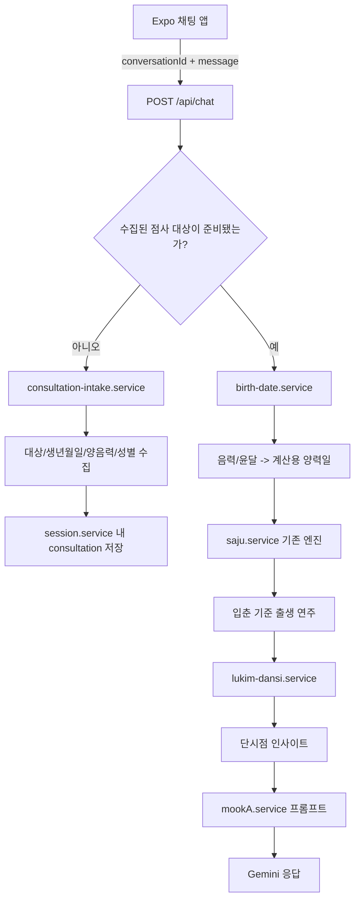

# projecta3 / 묵설 개발 인수인계

작성 기준일: 2026-05-25  
기준 작업 폴더: `D:\projecta3`

## 1. 프로젝트 목적

`projecta3`는 `projecta2`에서 파생된 별도 서비스다. 서버 폴더는 원본 프로젝트에서 복사해 시작했으며, 이 프로젝트에서 실제로 사용할 IP는 `묵설`이다.

최종 사용자 경험은 다음과 같다.

- 사용자는 채팅 상담으로 점, 운세, 오늘의 운세, 연애·직업·건강 등 질문을 한다.
- 묵설은 한국 토속신앙의 무당/샤먼 분위기를 가진 상담자여야 한다.
- 단순한 챗봇 답변이 아니라, 내부 점술 계산 결과를 바탕으로 대화를 이어가는 AI 상담 서비스가 목표다.
- `육임단시점`은 상담 초반부터 깔리는 가벼운 기본 흐름이다.
- `육임정단`은 특정 고민이 명확해졌을 때 더 깊게 사용하는 해석 계층이다.

중요한 제품 원칙:

- 묵설의 내부 계산명, 원괘 이름, 한자명, 수치 계산 과정은 그대로 사용자에게 노출하지 않는다.
- 사용자에게 보여주는 이름은 해석 데이터의 `outputName`과 같은 출력용 표상을 사용한다.
- 점술 결과는 묵설의 말투로 자연스럽게 풀어야 하며, 데이터 전문을 그대로 읽어주면 안 된다.

## 2. 확정된 도메인 규칙

### 2.1 육임단시점과 육임정단의 관계

- 육임단시점은 현재 상담의 밑바탕이다.
- 육임정단은 육임단시점 위에서 더 구체적인 질문을 깊게 해석하는 방식이다.
- 단시점을 정단 수준으로 비대하게 확장하지 않는다.
- 정단 데이터는 질문 키워드별로 확장할 계획이다. 현재 대표 구현은 `crush`다.

### 2.2 출생정보와 점사 대상

- 로그인 사용자 본인의 정보만 다루는 서비스가 아니다.
- 사용자는 본인 점사를 볼 수도 있고, 어머니·연인 등 다른 사람의 점사를 물을 수도 있다.
- 따라서 로그인 프로필의 생년정보는 본인 점사 선택 시 활용 가능한 후보일 뿐, 자동으로 현재 점사 대상이 되어서는 안 된다.
- 현재 계산 기준 인물은 `readingSubject`로 별도 관리한다.
- 관계 상담의 상대는 `relationshipTarget`으로 별도 관리한다.

### 2.3 양력, 음력, 입춘 기준

- 묵설은 채팅 중 자연스럽게 양력/음력 생년월일을 받을 수 있어야 한다.
- 음력 입력에는 윤달 여부가 중요하다.
- 음력 입력은 계산 전에 양력 날짜로 변환한다.
- 출생 연도의 간지는 기존 사주 엔진이 사용하는 `입춘 기준`으로 산출한다.
- 육임단시점과 이후 육임정단 모두 이 입춘 기준 출생 연주를 기반으로 사용한다.

### 2.4 현재 단시점 계산식

현재 `server/src/services/lukim-dansi.service.ts`의 계산은 다음을 사용한다.

- 남자: 출생 연주의 천간
- 여자: 출생 연주의 지지
- 점을 보는 현재 날짜의 일간
- 점을 보는 현재 시각의 시지

위 구성값을 수치화해 합산하고, 합산 결과에 해당하는 해석 데이터를 선택한다.

## 3. 현재 구현 구조



## 4. 완료된 작업

### 4.1 육임단시점 해석 데이터 확장

기준 파일:

- `server/src/data/lukim-interpretations.ts`

반영 내용:

- 사용자 제공 텍스트를 바탕으로 `뱀괘`부터 `용괘`까지의 상세 해석 데이터를 확장했다.
- 내부 이름과 사용자 출력용 이름을 분리하기 위해 `outputName` 구조를 사용한다.
- `재비괘` 표기는 루트 기준 파일에서 `제비괘`로 정리되어 있다.
- 해석 객체는 방향, 기본 읽기, 경계, 묵설 말투 힌트, 키워드별 풀이, 심화 조건 등을 담을 수 있도록 확장되어 있다.

주의:

- 기준 소스는 반드시 루트의 `server/src/data/lukim-interpretations.ts`다.
- `.claude/worktrees/pensive-chatelet-44d56a/server/src/data/lukim-interpretations.ts`는 오래된 별도 worktree 상태이며, 루트 파일과 내용이 다르다. 새 작업은 루트 파일을 기준으로 해야 한다.

### 4.2 상담 세션과 대화 기억 기반

관련 파일:

- `mookseoli/App.tsx`
- `server/src/controllers/fortune.controller.ts`
- `server/src/services/session.service.ts`
- `server/src/services/mookA.service.ts`

반영 내용:

- 앱 실행 세션마다 `conversationId`를 생성하고 `/api/chat`, `/api/session/nudge` 요청에 전달한다.
- 서버는 익명 사용자를 하나의 `"anonymous"` 세션으로 합치지 않고 대화 식별자별로 분리한다.
- 세션은 최근 대화 메시지 최대 16개를 보관한다.
- 묵설 AI 프롬프트에 같은 상담의 최근 대화 맥락을 전달한다.
- 다른 기기 또는 다른 실행 세션은 다른 `conversationId`를 사용하므로 상담 내용이 섞이지 않는다.

현재 저장 방식:

- 세션 상태와 대화 기록은 서버 프로세스 메모리에만 있다.
- 서버 재시작 시 상담 내용과 점사 대상 상태는 사라진다.
- 영구 저장소 연동은 아직 하지 않았다.

### 4.3 앱 채팅 UI 테스트 방해 요소 수정

관련 파일:

- `mookseoli/App.tsx`
- `mookseoli/package.json`
- `mookseoli/package-lock.json`

반영 내용:

- `react-native-safe-area-context`를 설치하고 하단 시스템 내비게이션 영역과 입력창이 겹치지 않게 처리했다.
- 키보드가 열릴 때 `KeyboardAvoidingView` 및 스크롤 처리를 적용해 입력 중인 텍스트가 키보드에 가려지지 않도록 했다.
- 현재 앱의 서버 주소는 `http://192.168.219.102:3001`로 설정되어 있다.

주의:

- 위 IP는 당시 로컬 테스트 환경의 PC 주소다. 네트워크가 바뀌면 앱 연결 주소도 다시 확인해야 한다.

### 4.4 육임단시점 서비스 분리와 프롬프트 연결

관련 파일:

- `server/src/services/lukim-dansi.service.ts`
- `server/src/services/today-fortune.service.ts`
- `server/src/services/mookA.service.ts`
- `server/src/controllers/fortune.controller.ts`

반영 내용:

- 오늘의 운세 내부에 섞여 있던 단시점 계산 책임을 `lukim-dansi.service.ts`로 분리했다.
- 일반 상담에서도 계산된 단시점 해석을 묵설 프롬프트에 넣을 수 있게 했다.
- 프롬프트에는 내부 괘 이름과 계산 방법을 출력하지 말라는 규칙을 포함한다.
- 실제 단시점 자료가 없을 때는 이미 점괘가 나온 것처럼 말하지 않도록 `DANSI_PENDING_BLOCK`을 사용한다.
- 실제 정단 인사이트가 없는데 정단을 한 것처럼 말하던 경로를 차단했다.

### 4.5 3-1: 점사 대상 도메인 상태 구조

관련 파일:

- `server/src/types/consultation.ts`
- `server/src/services/session.service.ts`

추가된 주요 모델:

- `ConsultationContext`
- `ConsultationPersonProfile`
- `BirthInformation`
- `IpchunBirthYearPillar`
- `readingSubject`
- `relationshipTarget`
- `accountProfileCandidate`

규칙:

- `readingSubject`가 현재 계산 기준 인물이다.
- `relationshipTarget` 추가만으로 기존 점사 결과를 초기화하지 않는다.
- 점사 대상 자체나 출생 기준 정보가 바뀌면 기존 단시점 결과와 현재 정단 시진을 초기화한다.

### 4.6 3-2: 대화형 출생정보 수집

관련 파일:

- `server/src/services/consultation-intake.service.ts`
- `server/src/types/consultation.ts`
- `server/src/services/session.service.ts`
- `server/src/controllers/fortune.controller.ts`

지원하는 수집 상태:

```ts
type ConsultationIntakeStage =
  | "idle"
  | "awaiting_subject"
  | "awaiting_birth"
  | "awaiting_calendar"
  | "awaiting_gender"
  | "ready";
```

지원 흐름:

- `"점 봐주세요"`처럼 대상이 모호하면 본인인지 다른 사람인지 묻는다.
- `"내 연애운 보고 싶어"`는 본인을 점사 대상으로 잡고 생년정보를 받는다.
- `"엄마 건강운 보고 싶어"`는 어머니를 점사 대상으로 잡고 생년정보를 받는다.
- `"남자친구와 잘 될까?"`는 본인을 점사 기준으로, 남자친구를 관계 대상으로 분리한다.
- 수집 질문은 Gemini 호출 없이 규칙 기반 응답으로 처리한다.
- 수집 대화는 깊은 점사로 보지 않으므로 정단 전환용 턴 수에 포함하지 않는다.

### 4.7 3-3: 수집 정보를 실제 계산에 연결

관련 파일:

- `server/src/services/birth-date.service.ts`
- `server/src/controllers/fortune.controller.ts`
- `server/src/services/today-fortune.service.ts`
- `server/src/services/mookA-debounce.service.ts`

반영 내용:

- `resolveSolarBirthDate()`를 추가해 양력, 음력 평달, 음력 윤달을 공통 처리한다.
- `ready` 상태의 `readingSubject` 생년정보를 일반 채팅 계산 입력으로 사용한다.
- 변환된 양력 날짜를 기존 `getSajuDetails()`에 전달한다.
- 기존 사주 엔진이 입춘 기준으로 산출한 출생 연주를 현재 대상의 `birthYearPillar`에 저장한다.
- 산출된 연주를 `calculateDansiResult()`에 전달해 실제 육임단시점을 생성한다.
- 동일한 변환 경계를 `오늘의 운세`에도 적용했다.
- 기존 직접 API 입력도 `isLeapMonth`를 전달할 수 있도록 확장했다.

수정으로 해결된 기존 불일치:

- 일반 채팅 경로가 음력 날짜를 변환하지 않은 채 양력처럼 계산하던 문제를 해결했다.
- 오늘의 운세 경로가 음력 윤달을 항상 평달로 계산하던 문제를 해결했다.

### 4.8 3-4: 실제 윤달 가능 날짜만 확인 질문

관련 파일:

- `server/src/services/birth-date.service.ts`
- `server/src/services/consultation-intake.service.ts`
- `server/src/types/consultation.ts`
- `server/src/types/korean-lunar-calendar.d.ts`
- `server/src/controllers/fortune.controller.ts`

반영 내용:

- `isLunarLeapDateAvailable()`를 추가해 입력된 음력 날짜가 실제 윤달 날짜로도 성립하는지 내부에서 확인한다.
- 음력 생일이라도 윤달이 없는 날짜라면 추가 질문 없이 평달로 저장하고 계산한다.
- 평달과 윤달이 모두 성립하는 날짜일 때만 `awaiting_leap_month` 상태로 멈추고 사용자에게 평달/윤달을 확인한다.
- 사용자가 존재하지 않는 윤달을 직접 말하면 계산하지 않고 생일 정보를 다시 받는다.
- 수집 흐름을 우회하는 직접 계산 입력에서도 윤달 가능 날짜인데 평달/윤달 구분이 없으면 계산을 거부한다.

예시:

- `음력 1998년 3월 2일` -> 내부 확인 후 자동 평달 처리
- `음력 2020년 4월 1일` -> 평달/윤달 추가 확인 필요
- `음력 윤달 1998년 3월 2일` -> 존재하지 않는 윤달로 판단해 재입력 요청

### 4.9 3-5: 같은 상담 안에서 점사 대상 변경

관련 파일:

- `server/src/types/consultation.ts`
- `server/src/services/session.service.ts`
- `server/src/services/consultation-intake.service.ts`

반영 내용:

- 현재 활성 점사 대상 외에 `knownSubjects`를 두어, 같은 상담에서 이미 받은 인물별 생년정보를 보존한다.
- 다른 인물의 점사 요청이 감지되면 즉시 기존 대상을 덮어쓰지 않고 `awaiting_subject_switch` 상태에서 전환 여부를 확인한다.
- 전환을 승인하면 기존 단시점과 정단 시진은 새 대상 기준으로 초기화하고, 새 대상의 정보가 없으면 수집을 시작한다.
- 이전에 정보를 받은 대상으로 다시 돌아가면 생년월일을 다시 묻지 않고 기존 정보를 재사용한다.
- `"남자친구와 궁합 봐줘"` 같은 관계 질문은 본인의 점사 기준을 유지하고 `relationshipTarget`만 분리한다.

예시:

```text
사용자: 내 운세 보고 싶어
... 본인 정보 수집 및 상담 ...
사용자: 엄마 건강운도 봐줘
묵설: 지금은 네 흐름을 보고 있어요. 이번에는 어머니의 흐름으로 바꿔 볼까요?
사용자: 네
... 어머니 정보 수집 후 상담 ...
사용자: 내 운세로 다시 돌아가자
묵설: 지금은 어머니의 흐름을 보고 있어요. 이번에는 네 흐름으로 바꿔 볼까요?
사용자: 네
→ 이전에 저장한 본인 정보 재사용
```

### 4.10 3-6: 관계 상담 상대 정보 수집과 내부 관계 근거

관련 파일:

- `server/src/types/consultation.ts`
- `server/src/services/consultation-intake.service.ts`
- `server/src/services/relationship-consultation.service.ts`
- `server/src/controllers/fortune.controller.ts`
- `server/src/services/mookA.service.ts`

반영 내용:

- `궁합`, `결혼`, `잘 될까`, `상대 마음`, `재회` 등 실제 상대가 있는 관계 심화 질문에서만 `relationshipTarget`의 출생정보를 추가 수집한다.
- `awaiting_relationship_birth`, `awaiting_relationship_calendar`, `awaiting_relationship_leap_month`, `awaiting_relationship_gender` 상태를 추가했다.
- 관계 상대 정보를 받는 동안에도 `readingSubject`는 본인으로 유지한다. 상대의 점사로 전환되는 것이 아니다.
- 상대의 양력/음력/윤달 처리는 본인과 같은 검증 규칙을 적용한다.
- 양쪽 정보가 준비되면 기존 `analyzeCoupleOhaeng()`를 재사용해 관계 상담용 내부 근거를 만든다.
- 상대의 입춘 기준 출생 연주도 `relationshipTarget.birthYearPillar`에 저장한다.
- `"나 남자친구 생겨?"`처럼 아직 특정 상대가 없는 연애 가능성 질문은 상대 정보 수집으로 진입하지 않는다.

정확도 제한:

- 현재 본인과 상대의 출생 시간을 별도로 수집하지 않는다.
- 기존 커플 엔진 결과 중 출생시간 가정에 영향을 받는 시주 기반 내용은 묵설 프롬프트에 주입하지 않는다.
- 관계 자료에는 출생시간 없이 사용할 수 있는 끌림 및 년주·월주 중심 흐름만 제공하며, 시기·자녀·말년 생활을 확정하지 말라는 규칙을 포함한다.

예시:

```text
사용자: 남자친구와 궁합 봐줘
... 본인 정보 수집 ...
묵설: 남자친구의 생년월일도 알려줘요...
... 상대 정보 수집 ...
사용자: 남자친구와 결혼 궁합은 어때?
→ 본인 단시점 기준은 유지
→ 양쪽 출생 흐름 비교 자료를 묵설 내부 프롬프트에 추가
```

### 4.11 3-7: 로그인 프로필 후보 연결 API

관련 파일:

- `server/src/types/consultation.ts`
- `server/src/services/account-profile.service.ts`
- `server/src/services/session.service.ts`
- `server/src/services/consultation-intake.service.ts`
- `server/src/controllers/fortune.controller.ts`
- `server/src/routes/fortune.router.ts`

반영 내용:

- `POST /api/session/account-profile-candidate`를 추가했다. 소셜 로그인 완료 후 받은 본인 프로필을 현재 대화 세션의 `accountProfileCandidate`로 연결하는 경계다.
- 입력은 `provider`(`kakao`, `naver`, `google`)와 선택적 `birthDate`, `calendarType`, `isLeapMonth`, `gender`, `displayName`을 받는다.
- 응답은 후보 정보의 보유 여부만 돌려주며, 생년월일 자체를 다시 노출하지 않는다.
- 후보 등록만으로 `readingSubject`를 만들거나 단시점 계산을 실행하지 않는다.
- 사용자가 본인 점사를 선택한 경우에만 기존 수집 흐름이 로그인 후보를 재사용한다. 타인의 점사에는 본인 로그인 정보를 사용하지 않는다.
- 검증 과정에서 최초 질문이 타인 점사일 때 본인 후보가 타인 프로필에 복사되던 조건을 발견해, `self` 대상인 경우에만 후보를 전달하도록 수정했다.

현재 경계:

- 이 API는 OAuth 인증 성공 결과를 전달받을 연결부이지, 카카오·네이버·구글 로그인을 직접 수행하거나 인증 토큰을 검증하지 않는다.
- 현재 세션 저장소가 메모리이므로 다른 기기, 앱 재실행, 서버 재시작까지 로그인 후보를 유지하려면 사용자 계정 저장소와 인증 미들웨어가 추가되어야 한다.

### 4.12 3-8: 사용자 계정 및 상담 세션 영구 저장 기반

관련 파일:

- `server/prisma/schema.prisma`
- `server/prisma/migrations/20260526000100_init_persistent_consultations/migration.sql`
- `server/.env.example`
- `server/src/services/database.service.ts`
- `server/src/services/account-identity.service.ts`
- `server/src/services/persistent-session.service.ts`
- `server/src/services/session.service.ts`
- `server/src/controllers/fortune.controller.ts`
- `server/src/index.ts`

반영 내용:

- PostgreSQL + Prisma를 도입하고 `AppUser`, `SocialAccount`, `AccountProfileCandidate`, `ConsultationSession` 모델을 구성했다.
- 소셜 공급자는 DB enum으로 `kakao`, `naver`, `google`만 허용한다.
- OAuth 토큰 검증 이후 공급자 계정을 내부 사용자 ID와 결합하는 `findOrCreateUserFromVerifiedIdentity()`를 추가했다.
- 메모리 세션의 상담 컨텍스트, 최근 대화, 턴 수, 단시점 상태를 스냅샷으로 내보내고 복원하는 함수를 추가했다.
- 인증 미들웨어가 `res.locals.authenticatedUserId`를 넣는 경우에만 로그인 후보와 상담 세션을 DB에 저장·복원하도록 컨트롤러 경계를 연결했다.
- 저장된 상담 ID는 소유 사용자만 복원할 수 있으며, 다른 사용자 또는 비로그인 요청이 같은 ID로 접근하면 `403`으로 차단한다.
- `DATABASE_URL`이 없는 기존 개발 실행에서는 DB 계층을 비활성화하고 현재 메모리 상담 동작을 유지한다.

현재 경계:

- 실제 카카오·네이버·구글 OAuth 인증 미들웨어는 아직 없다. 따라서 현재 앱 요청만으로 영구 저장 모드가 활성화되지는 않는다.
- 2026-05-26 기준 Neon의 `mookseol-dev` 데이터베이스에 초기 Prisma 마이그레이션을 적용했다.
- 실제 Neon DB에서 테스트 소셜 계정 생성, 로그인 후보 저장, 상담 스냅샷 복원, 다른 사용자·비로그인 접근 차단을 검증했고 테스트 레코드는 삭제했다.
- 스냅샷은 현재 AI 대화 맥락으로 유지하는 최근 메시지 범위를 저장한다. 사용자가 과거 상담 전체를 열람하는 기록 보관 기능은 별도 모델 확장이 필요하다.

### 4.13 3-9: 네이버 로그인 MVP 서버 연결

관련 파일:

- `server/prisma/schema.prisma`
- `server/prisma/migrations/20260526000200_add_auth_sessions/migration.sql`
- `server/src/middleware/authentication.middleware.ts`
- `server/src/services/auth-session.service.ts`
- `server/src/services/naver-auth.service.ts`
- `server/src/controllers/auth.controller.ts`
- `server/src/routes/auth.router.ts`
- `server/src/index.ts`

반영 내용:

- 우선 로그인 공급자를 카카오에서 네이버로 변경했다. DB의 공급자 구조는 카카오·네이버·구글 확장이 가능한 형태를 그대로 유지한다.
- `GET /api/auth/naver/start?conversationId=...`는 일회용 OAuth `state`를 DB에 저장한 뒤 네이버 인증 화면으로 이동시킨다.
- `GET /api/auth/naver/callback`은 `state`를 한 번만 소비하고, 인증 코드로 액세스 토큰 및 네이버 프로필을 조회한다.
- 네이버 사용자 식별자는 `SocialAccount`를 통해 내부 `AppUser`와 연결한다.
- 네이버에서 받은 `출생연도 + 생일`, `성별`, `별명`은 `accountProfileCandidate`로 저장한다. 네이버가 음력/양력을 확정하지 않으므로 `calendarType`은 저장하지 않고, 본인 점사 진입 시 채팅에서 확인한다.
- `AuthSession`에는 앱 로그인 세션 토큰의 SHA-256 해시만 저장하고, 원문 토큰은 브라우저의 `HttpOnly`, `SameSite=Lax` 쿠키로 전달한다.
- 인증 미들웨어는 로그인 쿠키 또는 향후 모바일용 `Authorization: Bearer` 토큰을 인식하여 기존 상담 저장·소유권 검사에 `authenticatedUserId`를 제공한다.
- 브라우저 기준 로그아웃 및 인증 상태 확인 경로(`/api/auth/logout`, `/api/auth/session`)를 추가했다.

검증 상태:

- 인증 세션 및 OAuth state 테이블 마이그레이션을 Neon 실DB에 적용했다.
- 네이버 토큰·프로필 API 응답은 모의하고, OAuth state 생성/소비, 프로필 후보 변환, 인증 쿠키 발급, Neon 저장 및 인증 복원을 실제 DB로 검증했다.
- 검증용 DB 레코드는 삭제했다.
- 실제 네이버 계정 동의 화면을 통과하는 브라우저 로그인은 사용자가 직접 실행해야 하며 아직 대기 상태다.
- 현재 로그인 완료 방식은 PC 브라우저 쿠키 기반이다. Expo 휴대폰 앱으로 로그인 완료 상태를 전달하는 흐름은 후속 단계다.

## 5. 현재 채팅 동작 예시

### 5.1 본인 점사

```text
사용자: 내 연애운 보고 싶어
묵설: 네 생년월일을 알려줘요...
사용자: 음력 1998년 3월 2일
묵설: ...남자분인가요, 여자분인가요?
사용자: 여자예요
묵설: ...받아둘게요. 이제 보고 싶은 흐름을 이어서 말해줘요.
사용자: 올해 연애운은 어때?
```

마지막 질문에서 수행되는 일:

- 저장된 본인 정보를 가져온다.
- 음력을 양력으로 변환한다.
- 기존 사주 엔진으로 입춘 기준 출생 연주를 계산한다.
- 육임단시점을 생성한다.
- 해석 결과를 내부 자료로 묵설 프롬프트에 넣는다.

### 5.2 타인 점사

```text
사용자: 엄마 건강운 보고 싶어
묵설: 어머니의 생년월일을 알려줘요...
사용자: 양력 1968년 3월 2일
묵설: ...받아둘게요. 이제 보고 싶은 흐름을 이어서 말해줘요.
사용자: 건강 흐름을 더 봐줘
```

이 경우 `readingSubject`는 어머니다. 사용자의 본인 정보와 혼용하지 않는다.

### 5.3 오늘의 운세와 음력 윤달

```text
사용자: 내 오늘 운세 보고 싶어
사용자: 음력 2020년 4월 1일
묵설: 네 음력 생일은 평달인가요, 윤달인가요? ...
사용자: 윤달이에요
사용자: 남자예요
사용자: 오늘의 운세 봐줘
```

이 경우 음력 윤달을 반영한 양력 변환 결과를 사용해 오늘의 운세와 단시점을 계산한다.

## 6. 검증 완료 항목

실행한 주요 검증:

- `server`에서 `npm.cmd run build` 통과.
- 대화 기록이 같은 `conversationId` 안에서 유지되는지 확인.
- 서로 다른 상담 세션의 메시지와 점사 대상이 분리되는지 확인.
- 본인, 타인, 관계 상담의 정보 수집 상태 전환 확인.
- 수집 완료 뒤 동일 상담에서 생년정보를 반복 요구하지 않는지 확인.
- 수집 과정의 질문이 정단 전환 턴으로 누적되지 않는지 확인.
- 양력 날짜가 그대로 유지되는지 확인.
- 음력 평달과 음력 윤달이 다른 계산용 양력일로 변환되는지 확인.
- 윤달이 없는 음력 날짜는 추가 질문 없이 평달로 저장되는지 확인.
- 윤달 가능 날짜만 `awaiting_leap_month` 상태로 추가 확인하는지 확인.
- 존재하지 않는 음력 윤달 입력이 계산 전에 차단되는지 확인.
- 직접 API 계산 입력에서도 구분되지 않은 윤달 가능 날짜가 자동 평달 계산되지 않는지 확인.
- 입춘 전후 출생일에 대해 기존 사주 엔진의 연주가 달라지는지 확인: `丁丑 -> 戊寅`.
- 수집된 점사 대상의 연주가 세션에 저장되고 단시점 인사이트가 만들어지는지 확인.
- 수집된 음력 윤달 정보가 오늘의 운세 계산 경로에도 유지되는지 확인.
- 다른 점사 대상 요청 시 전환 승인 전까지 기존 대상이 유지되는지 확인.
- 전환 취소 시 기존 대상 상담이 그대로 유지되는지 확인.
- 본인 -> 어머니 -> 본인 전환 시 이전 본인 생년정보가 재사용되는지 확인.
- 관계 질문이 현재 점사 대상을 바꾸지 않고 관계 대상만 저장하는지 확인.
- 현 연인 궁합 질문에서 본인 수집 완료 후 상대 생년정보 수집으로 이어지는지 확인.
- 상대 음력 생일에도 윤달 가능 날짜만 추가 확인하는지 확인.
- 성별을 추론할 수 없는 관계 상대는 성별을 별도 수집하는지 확인.
- 양쪽 생년정보가 준비된 뒤 관계 자료가 AI 내부 입력으로 주입되고 상대의 입춘 기준 연주가 저장되는지 확인.
- `"나 남자친구 생겨?"` 질문에서는 특정 상대 생년정보를 요구하지 않는지 확인.
- 로그인 후보를 등록하는 것만으로 현재 점사 대상이 활성화되지 않는지 확인.
- 로그인 후보는 본인 점사를 선택한 경우에만 재사용되고, 어머니 등 타인 점사에는 섞이지 않는지 확인.
- 로그인 후보 API가 잘못된 날짜 입력을 거부하는지 확인.
- Prisma 스키마가 유효하며 서버 TypeScript 빌드가 통과하는지 확인.
- 모의 저장소에서 로그인 후보 및 상담 스냅샷 저장·복원이 가능한지 확인.
- 저장 상담에 대해 다른 사용자와 비로그인 접근이 차단되는지 확인.
- Neon 실DB에 초기 마이그레이션이 적용되는지 확인.
- Neon 실DB에서 테스트 계정·후보·상담 저장 및 복원·소유권 차단이 동작하고 테스트 데이터가 제거되는지 확인.
- 네이버 로그인 OAuth state 및 인증 세션 테이블이 Neon 실DB에 적용되는지 확인.
- 모의 네이버 프로필을 이용해 생년정보 후보가 음양력 미확정 상태로 저장되고, 인증 쿠키가 발급·복원되는지 확인.

검증 방식 주의:

- 계산 및 세션 연결 테스트에서는 Gemini 실제 호출을 대체해 내부 흐름을 검증했다.
- 실제 API 모델 응답의 표현 품질은 앱에서 별도 사용자 테스트가 필요하다.

## 7. 아직 미완료이거나 주의할 문제

### 7.1 직접 API 호출의 입력 오류 응답 정리

채팅 수집 흐름에서는 윤달 가능 날짜일 때 자연스럽게 추가 질문을 한다. 다만 수집을 우회해 `birthDate`, `calendarType`, `gender`를 body에 직접 보내는 호출에서 윤달 구분이 빠지면 현재 계산을 거부하는 오류로 처리된다.

다음 작업 후보:

- `/api/chat`과 `/api/today`의 직접 입력 오류를 사용자 입력 오류인 `400` 응답으로 정리한다.
- 직접 호출을 사용하는 클라이언트가 있다면 `isLeapMonth` 필드를 반드시 보내도록 API 계약을 명시한다.

### 7.2 대상 전환 문장 해석 범위

명확한 `"엄마 운세도 봐줘"`, `"내 운세로 돌아가자"` 형태의 전환은 처리한다. 그러나 한 문장에 여러 사람과 본인의 고민이 섞인 복합 표현은 첫 번째로 감지되는 대상에 따라 전환 확인이 제시될 수 있다.

다음 작업 후보:

- 실제 사용자 테스트에서 잘못 전환 질문이 발생하는 발화를 수집해 의도 분류 규칙을 보완한다.

### 7.3 관계 상담의 출생시간 및 정단 확장

상대 생년정보 수집과 기본 관계 근거는 연결되었다. 다만 본인과 상대의 출생시간은 아직 수집하지 않으므로, 커플 엔진의 시주 영역은 사용하지 않는다. 또한 현재 관계 자료는 사주 기반 보조 근거이며, 현 연인 문제별 육임정단 데이터가 완성된 상태는 아니다.

다음 작업 후보:

- 더 정밀한 궁합이 필요할 때만 양쪽 출생시간을 추가 수집하는 흐름을 설계한다.
- 현 연인 갈등, 결혼 가능성, 권태기, 이별/재회용 육임정단 데이터를 확장해 관계 자료와 함께 사용한다.

### 7.4 로그인 및 영구 저장

- 카카오, 네이버, 구글 로그인은 아직 구현되지 않았다.
- 로그인 결과의 본인 생년정보를 현재 상담의 `accountProfileCandidate`에 연결하는 API는 구현되었다.
- Prisma 기반 계정·상담 세션 저장 계층과 초기 마이그레이션은 구현되었다.
- Neon PostgreSQL 연결과 저장·복원 검증은 완료되었다.
- 네이버 OAuth 서버 경로와 로그인 세션 검증 계층은 구현되었다.
- 다만 실제 사용자 네이버 로그인 브라우저 검증과 Expo 앱에 로그인 세션을 전달하는 UI 흐름은 아직 남아 있다.

다음 작업 후보:

- PC 브라우저에서 네이버 실제 로그인과 동의 후 후보 정보 저장·상담 복원을 확인한다.
- Expo 앱에서 네이버 로그인 버튼과 앱 복귀 후 인증 세션 전달 방식을 구현한다.
- 카카오 로그인은 개인정보 동의항목 승인 준비가 된 뒤 추가한다.

### 7.5 육임정단 데이터 범위

- `server/src/data/jeongdan/crush`는 존재하며 짝사랑 흐름용으로 활용된다.
- `breakup`은 비어 있는 파일로 판단되어 작업 대상에서 제외된 상태였다.
- 현 연인 문제, 연애 시작 가능성, 이별/재회 등 주요 실사용 질문별 정단 데이터 확장은 아직 필요하다.

### 7.6 코드 저장 상태

현재 변경 사항은 커밋되지 않은 작업 상태다. 다른 AI는 임의로 리셋하거나 덮어쓰지 말고, 기존 변경을 유지한 채 이어서 작업해야 한다.

현재 관련 변경 파일:

- `mookseoli/App.tsx`
- `mookseoli/package.json`
- `mookseoli/package-lock.json`
- `server/src/controllers/fortune.controller.ts`
- `server/src/routes/fortune.router.ts`
- `server/src/routes/auth.router.ts`
- `server/src/controllers/auth.controller.ts`
- `server/src/middleware/authentication.middleware.ts`
- `server/src/services/account-profile.service.ts`
- `server/src/services/account-identity.service.ts`
- `server/src/services/auth-session.service.ts`
- `server/src/services/database.service.ts`
- `server/src/services/mookA-debounce.service.ts`
- `server/src/services/mookA.service.ts`
- `server/src/services/persistent-session.service.ts`
- `server/src/services/naver-auth.service.ts`
- `server/src/services/session.service.ts`
- `server/src/services/today-fortune.service.ts`
- `server/src/services/birth-date.service.ts`
- `server/src/services/consultation-intake.service.ts`
- `server/src/services/lukim-dansi.service.ts`
- `server/src/services/relationship-consultation.service.ts`
- `server/src/types/consultation.ts`
- `server/prisma/schema.prisma`
- `server/prisma/migrations/20260526000100_init_persistent_consultations/migration.sql`
- `server/prisma/migrations/20260526000200_add_auth_sessions/migration.sql`

## 8. 권장 다음 단계

현재 단계 기준으로 바로 다음에 다룰 가치가 큰 순서는 다음과 같다.

1. 앱에서 실제 대화 품질을 점검한다. 계산값이 들어간 뒤 묵설이 답변이 자연스럽고 내부 괘명이 노출되지 않는지 본다.
2. 직접 API의 입력 오류 응답과 `isLeapMonth` 계약을 정리한다.
3. 대상 전환 발화의 실제 사용자 테스트와 오탐 규칙을 보완한다.
4. 관계 상담에서 출생시간을 받을 범위와 현 연인용 육임정단 연결 기준을 설계한다.
5. 네이버 실제 로그인 브라우저 검증을 완료하고 Expo 앱 로그인 연결 방식을 구현한다.
6. 실사용 빈도가 높은 육임정단 질문군 데이터를 확장한다.

## 9. 다른 AI가 작업할 때 지켜야 할 기준

- 사용자는 한국어 응답만 원한다.
- 좋은 구조는 좋다고, 취약한 구조는 취약하다고 객관적으로 말해야 한다.
- 코드를 수정하기 전에 현재 루트 워크스페이스의 변경 상태부터 확인한다.
- `.claude/worktrees/...`보다 루트 `D:\projecta3`의 파일을 기준으로 작업한다.
- 기존 사주 엔진의 입춘 기준 연주 계산을 새로 복제하지 말고 재사용한다.
- 육임단시점은 상담의 바탕, 육임정단은 깊은 질문용이라는 계층을 깨지 않는다.
- 내부 점술 데이터와 계산 과정을 사용자 출력에 그대로 노출하지 않는다.
- 한 단계를 구현하고 검증한 뒤 사용자와 점검하고 다음 단계로 넘어간다.
